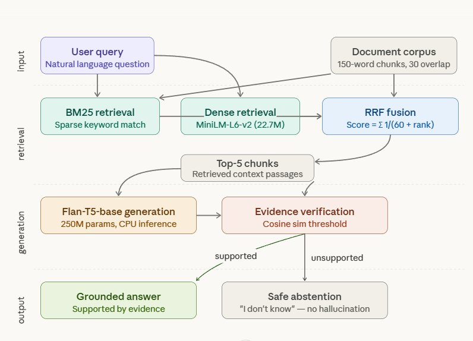

# LightweightRAG: A Training-Free Framework for Hallucination Reduction

[]()
[]()
[]()
[](https://colab.research.google.com/github/akanksha2130/lightweightrag-hallucination/blob/main/notebooks/LightweightRAG_Experiments.ipynb)

> **Paper:** *LightweightRAG: A Training-Free Framework for Hallucination Reduction in Resource-Constrained Environments*  
> **Author:** Akanksha Singh

---

## What is LightweightRAG?

LightweightRAG is a **CPU-only, training-free hybrid RAG pipeline** that reduces LLM hallucination using only off-the-shelf open-source components — no GPU, no fine-tuning, no proprietary infrastructure required.

It combines:
- **BM25** sparse retrieval (keyword matching)
- **all-MiniLM-L6-v2** dense retrieval (semantic similarity, 22.7M params)
- **Reciprocal Rank Fusion** (parameter-free combination)
- **Flan-T5-base** answer generation (250M params, instruction-tuned)
- **Evidence verification** (cosine similarity threshold for safe abstention)

### Key Results

| Dataset | Baseline Hall. | LightweightRAG Hall. | Reduction | Significance |
|---------|---------------|----------------------|-----------|--------------|
| SQuAD v2.0 (real LLM, n=100) | 97.0% | 37.0% | **62%** | p < 0.001 |
| BoolQ (real LLM, n=100) | 70.0% | 32.0% | **54%** | p < 0.001 |
| SQuAD v2.0 (proxy oracle, n=300) | 70.8% | 16.2% | **77%** | p < 0.001 |

**Retrieval pipeline latency: 0.23 s | Full system latency: 2.47 s — on Colab CPU**

---

## Repository Structure

```
lightweightrag-hallucination/
│
├── src/                          ← Core library (import this)
│   ├── __init__.py
│   ├── pipeline.py               ← LightweightRAG class (main pipeline)
│   ├── evaluation.py             ← EM, F1, McNemar test, Wilson CI
│   └── data_utils.py             ← SQuAD v2.0 and BoolQ data loaders
│
├── notebooks/
│   └── LightweightRAG_Experiments.ipynb   ← Reproduces ALL paper tables
│
├── assets/
│   ├── architecture.png          ← Figure 1: Pipeline architecture
│   ├── ablation_chart.png        ← Figure 2: Ablation bar chart
│   └── threshold_sensitivity_curve.png    ← Figure 3: Threshold trade-off
│
├── requirements.txt              ← Pinned package versions
└── README.md
```

---

## Quick Start

### Option 1: Open in Colab (Recommended — no setup needed)

Click the **Open in Colab** badge above. The notebook installs all dependencies automatically.

> ⚠️ **Important:** In Colab, go to **Runtime → Change runtime type → CPU**.  
> This paper specifically evaluates CPU-only performance — do NOT select GPU.

### Option 2: Run locally

```bash
git clone https://github.com/akanksha2130/lightweightrag-hallucination.git
cd lightweightrag-hallucination
pip install -r requirements.txt
```

```python
from src.pipeline import LightweightRAG

# Initialise pipeline (downloads models on first run, ~500 MB)
rag = LightweightRAG(verbose=True)

# Build index from your documents
passages = [
    "The Colorado River flows through the Grand Canyon in Arizona. "
    "It is approximately 1,450 miles long.",
    "The Eiffel Tower was completed in 1889 in Paris, France.",
]
rag.build_index(passages)

# Ask a question
result = rag.answer("What river flows through the Grand Canyon?")
print(result["answer"])    # → "Colorado River"
print(result["abstained"]) # → False
print(result["latency"])   # → {'retrieval': 0.22, 'generation': 1.94, ...}
```

---

## Reproducing Paper Results

Open `notebooks/LightweightRAG_Experiments.ipynb` in Colab and run cells in order.

Each cell is labelled with the corresponding paper table:

| Cell | Experiment | Paper Table |
|------|-----------|-------------|
| 6–9  | SQuAD Real LLM (3 configs) | Table I |
| 10   | BoolQ Real LLM (3 configs) | Table II |
| 11   | SQuAD Proxy Oracle (n=300) | Table III |
| 12   | McNemar significance tests | Table V |
| 13   | Ablation study | Table VI |
| 14   | Threshold sensitivity | Table VII |
| 15   | Latency breakdown | Table VIII |
| 16   | TinyLlama comparison | Section VI-I |

---

## Pipeline Architecture



---

## API Reference

### `LightweightRAG`

```python
LightweightRAG(
    embed_model    = "sentence-transformers/all-MiniLM-L6-v2",
    gen_model      = "google/flan-t5-base",
    tau_extractive = 0.25,   # verification threshold for span QA
    tau_boolean    = 0.30,   # verification threshold for yes/no QA
    top_k          = 5,      # chunks retrieved per retriever
    verbose        = False,
)
```

| Method | Description |
|--------|-------------|
| `build_index(passages)` | Chunk passages, build BM25 + FAISS index |
| `answer(question, mode)` | Full pipeline → `{answer, abstained, chunks, latency}` |

**`mode`:** `"extractive"` (SQuAD-style) or `"boolean"` (BoolQ-style)

### Threshold guide

| τ value | Hallucination | Refusal | Best for |
|---------|--------------|---------|----------|
| 0.10 | 37% | 34% | General assistant |
| 0.25 ★ | 18% | 63% | **Default (balanced)** |
| 0.35 | 7% | 87% | High-safety (medical, legal) |

---

## Hardware Requirements

| Component | Minimum | Used in paper |
|-----------|---------|---------------|
| CPU | Any x86-64 | Google Colab free tier (~2 cores) |
| RAM | 6 GB | 12 GB available |
| GPU | **Not required** | **Not used** |
| Storage | 2 GB (models) | — |

---

## Citation

If you use this code or paper, please cite:

```bibtex
@inproceedings{singh2025lightweightrag,
  title     = {LightweightRAG: A Training-Free Framework for Hallucination
               Reduction in Resource-Constrained Environments},
  author    = {Singh, Akanksha},
  booktitle = {Under Review — IEEE Conference},
  year      = {2026},
  note      = {Code: https://github.com/akanksha2130/lightweightrag-hallucination}
}
```

---

## License

MIT License — free to use, modify, and distribute with attribution.
